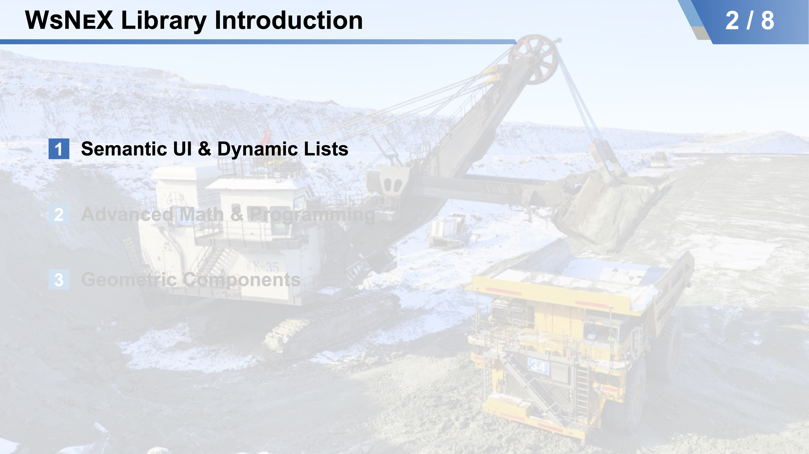
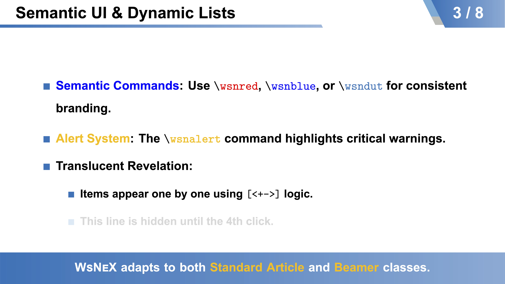
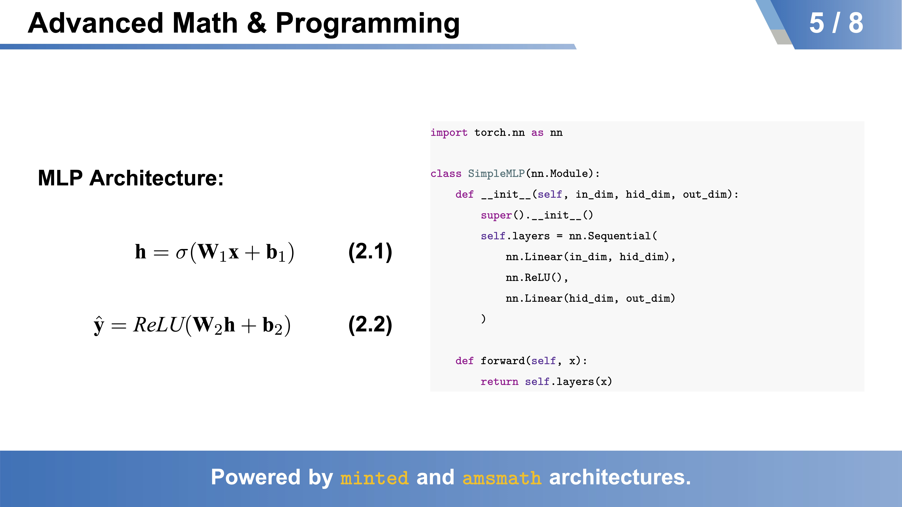
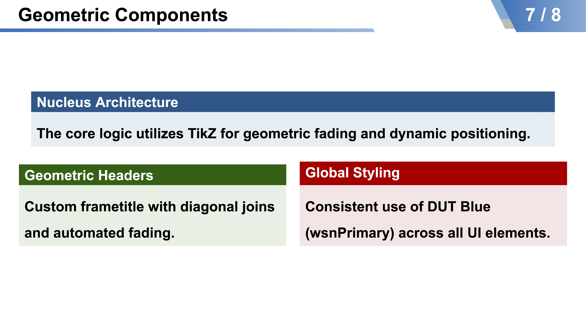

# WsNeX: A Unified LaTeX Library for Academic Excellence

[](https://www.latex-project.org/)
[](https://opensource.org/licenses/MIT)

**WsNeX** is a high-performance LaTeX framework designed to bridge the gap between rigorous academic manuscripts and professional technical presentations. Developed for researchers and engineers, it provides a unified visual identity and a robust macro architecture.

---

## 🎨 Visual Showcase

### Technical Presentations (Beamer)






### Scientific Manuscripts (Article)
*Clean, Standardized Typography for Journals*

---

## 🚀 Key Features

* **Unified Branding**: Consistent use of `wsnPrimary` (DUT Blue) across all document types.
* **Geometric Beamer UI**: Custom-engineered `frametitle` using TikZ with diagonal joins and path fading.
* **Dynamic Title Architecture**: Automated calculation of author/institute boxes to ensure perfect geometric alignment regardless of text length.
* **Semantic Commands**: Intuitive shortcuts for technical writing:
    * `\wsndefi{...}`: Styled emphasis for definitions.
    * `\wsnalert{...}`: High-visibility alerts for critical notes.
    * `\wsndut{...}`: Branding-compliant text color.
* **Code-First Integration**: Built-in support for `minted` providing high-fidelity syntax highlighting (Xcode style).
* **Advanced Math Support**: Pre-configured `amsmath`, `bm` (bold math), and `pifont` for complex technical documentation.

---

## 🛠 Installation & Requirements

### 1. Prerequisites
Ensure your TeX distribution is up to date (TeX Live 2023+ recommended).
* **Engine**: `XeLaTeX` or `LuaLaTeX` (required for system font loading).
* **System Fonts**: You must keep `arial.ttf` and `msyh.ttc` (Microsoft YaHei) in your working directory.
* **Python**: Required for the `minted` package (for code highlighting).

### 2. Usage
Clone the repository and ensure the `.sty` files are in your working directory:

**For Presentations:**
```latex
\documentclass[aspectratio=169]{ctexbeamer}
\usepackage{wsnex-beamer} % Loads wsnex-base automatically

\title{Your Title}
\author{Your Name}
\institute{Your Institute}

\begin{document}
% =============================================================================
% 1. TITLE PAGE
% =============================================================================
{
    \usebackgroundtemplate{
        \tikz[overlay, remember picture]\node[opacity=0.6] at (current page.center){
            \includegraphics[width=\paperwidth]{fig/BG.jpg}
            };
        }
    \maketitle
}

% =============================================================================
% 2. MAIN BODY
% =============================================================================
% Your frames here

% =============================================================================
% 3. END COVER
% =============================================================================
{
    \usebackgroundtemplate{
        \tikz[overlay, remember picture]\node[opacity=0.6] at (current page.center){
            \includegraphics[width=\paperwidth]{fig/BG.jpg}
            };
        }
    \maketitle
}
\end{document}
```

**For Manuscripts:**
```latex
\documentclass[12pt]{article}
\usepackage{wsnex-base}
\geometry{left=2.5cm, right=2.5cm, top=2.8cm, bottom=2.5cm}

\title{Your Title}
\author{Your Name}
\affil{Your Institute}
\date{\today}

\begin{document}
\maketitle

% Your content here

\end{document}
```

---

## 📂 Repository Structure
```
.
├── wsnex-base.sty      # Core engineering library (Math, Fonts, Colors)
├── wsnex-beamer.sty    # UI Library for Beamer presentations
├── presentation.tex    # Template for technical slides
├── manuscript.tex      # Template for academic papers
├── fig/                # Image assets (logos, backgrounds)
├── arial.ttf           # Required Arial font asset
└── msyh.ttc            # Required Microsoft YaHei font asset
```

---

## 🔧 Technical Notes
- **Shell Escape**: When using code blocks (via ```minted```), compile your document with the ```-shell-escape``` flag:
```xelatex -shell-escape presentation.tex.```

- **Table of Contents**: The Beamer class is configured to automatically show a TOC at the beginning of each section with a custom background template.

---

## 🤝 Contributing

Contributions are welcome! Please feel free to submit a Pull Request.

---

## 📄 License
Distributed under the MIT License. See ```LICENSE``` for more information.